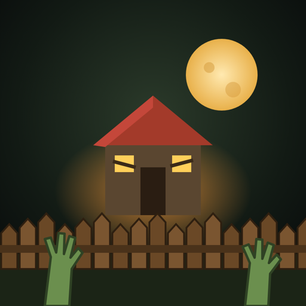

# Last Haven

**The world ended. Your story doesn't have to.**

Last Haven is a zombie-apocalypse base builder for iPhone and iPad: part farm game, part *Age of Empires*. Lead a small band of survivors. Scavenge the ruins, build a settlement, fortify it with walls and watchtowers, train guards and send them on patrol. Then survive the horde that comes every night.

<p align="center"></p>

## The gameplay loop

| Phase | What you do |
|---|---|
| ☀️ **Day** (~110 s) | Assign survivors to jobs: 🪓 lumberjacks chop trees, 🔧 salvagers strip car wrecks for scrap, 🌽 farmers grow food. Build and expand. |
| 🏚 **Scavenge** | Tap a ruin (gold marker) to send a scavenger out. Ruins farther from home pay more: wood, scrap, food, new survivors, and sometimes Caps. Wandering zombies make the trip dangerous. |
| 🌇 **Dusk** | A warning names the direction the horde is coming from, and red arrows mark that edge of the map. You have 15 seconds to patch the walls. |
| 🌙 **Night** (~55 s) | Survivors shelter inside the HQ. Zombies follow a flow field toward your buildings, look for gaps, and chew through the weakest wall. Towers, guards, patrols and spike traps hold the line. |
| 🥫 **Dawn** | Everyone eats. A well-fed Haven attracts new survivors. You earn Caps for every night survived. |

Every 5th night is a 🩸 **Blood Moon**: a bigger horde led by an **Abomination** boss.

From Day 2, daytime brings **events**: a wandering trader, refugees asking to join, or radio chatter about a supply cache.

**Goal:** survive 20 nights and the rescue convoy arrives. After that you can keep playing in endless mode.

### Buildings
Wood Wall · Steel Wall (Day 3) · Watchtower · House (+4 pop) · Farm · Barracks (train guards) · Spike Trap (Day 2)

### Upgrades
- **Watchtower** → Rifle Nest → Machine Gun Nest
- **HQ** → Fortified HQ (rooftop sniper, +4 pop) → Stronghold
- **House** → Bunkhouse (7 pop) · **Farm** → Irrigated Farm (3 farmers) · **Wood Wall** → Steel Wall

### Units
- **Survivors**: gather resources, farm and scavenge. They hide at night.
- **Guards**: trained at the Barracks. Tap one to **Move** it to a post or set a **Patrol** route.
- **Mercenaries**: elite gunners hired with Caps.

### Zombies
- **Walker**: slow and steady
- **Runner**: fast and fragile (from Day 2)
- **Brute**: a tank that wrecks walls (from Day 4)
- **Spitter**: lobs acid at walls and people from range (from Day 6)
- **Abomination**: the Blood Moon boss, with a health bar and a Caps bounty

### Goals
Seventeen guided goals teach the game. The control each early goal needs pulses. Each goal pays its Caps once per player, not once per run ("Hold the line", "Scavenger run", "On patrol"…) and pay out Caps.

## Monetization (in-app purchases)

Premium currency is **Caps** (bottle caps, the currency of the wasteland). Players can also earn Caps by surviving nights, completing goals, scavenging ruins and killing Brutes, so the game never requires a purchase to progress.

| Product ID | Type | Price | Contents |
|---|---|---|---|
| `lasthaven.starter` | Non-consumable | $2.99 | 300 Caps + every run starts with +2 survivors, +1 guard and a golden HQ |
| `lasthaven.caps.small` | Consumable | $0.99 | 120 Caps |
| `lasthaven.caps.medium` | Consumable | $4.99 | 650 Caps |
| `lasthaven.caps.large` | Consumable | $9.99 | 1,400 Caps |
| `lasthaven.doubleloot` | Non-consumable | $3.99 | Permanently doubles scavenging loot |

**What Caps buy:** 📦 Supply Drop (30) · 💥 Airstrike (40) · 🎖️ Mercenary (35) · ⏩ Finish construction instantly · ❤️ Revive a fallen Haven (60)

On iOS, purchases go through Apple StoreKit via [`cordova-plugin-purchase`](https://github.com/j3k0/cordova-plugin-purchase). In a web browser the game uses a clearly labelled **TEST STORE**, so you can try the full purchase flow without being charged.

## Tech

- **TypeScript + HTML5 Canvas**: no game engine, no art files. Everything is drawn procedurally, the UI uses a custom SVG icon set, and the music and sound effects are synthesized with WebAudio.
- Player data (purchased Caps, unlocks) is stored in iOS native storage via `@capacitor/preferences`, so iOS can't purge it.
- **Vite** for development and builds
- **Capacitor 8** wraps the web game as a native iOS app (`ios/`)
- **Vitest** for the simulation tests

```
src/
  game/
    config.ts   ← ALL balance numbers (costs, HP, damage, horde size, prices in Caps)
    world.ts    ← map generation, seeded RNG
    game.ts     ← simulation: day/night, jobs, scavenging, combat, waves
    flow.ts     ← zombie pathfinding (Dijkstra flow field; walls cost more the tougher they are)
    quests.ts   ← guided goals
    render.ts   ← canvas renderer: terrain, units, lighting, fog of war
    state.ts    ← save-game data types
  platform/
    store.ts    ← in-app purchases (StoreKit + browser test store)
    profile.ts  ← save data (Caps, purchases, best score, current run)
    audio.ts    ← procedural sound
  app.ts        ← game loop, touch controls, HUD, shop, menus
ios/            ← Xcode project (Capacitor)
tests/          ← simulation tests
docs/APP_STORE.md ← step-by-step guide to App Store release
```

## Run it

```bash
npm install
npm run dev        # play in your browser at http://localhost:5173
npm test           # simulation tests
npm run build      # production web build in dist/
```

**Controls:** drag to pan · pinch or scroll to zoom · tap to select · drag to paint walls · Space toggles 2× speed on desktop.

## Ship it to the App Store

See **[docs/APP_STORE.md](docs/APP_STORE.md)**. In short, on a Mac with Xcode:

```bash
npm install
npm run ios:sync   # build the game and copy it into the iOS project
npm run ios:open   # open in Xcode → set your Team → Run / Archive
```
